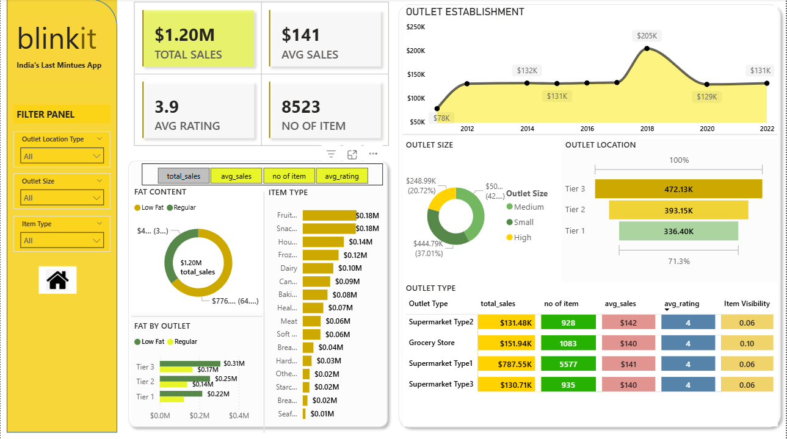

# 📊 Blinkit Sales Analysis

This project analyzes **Blinkit’s sales performance** to uncover insights about category trends, seasonal demand, and top-performing products. The goal was to transform raw data into actionable insights through **Excel** and **Power BI** dashboards.

---

## 🎯 Objective

To understand Blinkit’s sales dynamics and identify which product categories, time periods, and regions contribute most to overall revenue.

---

## 🧩 Tools & Technologies

- **Excel** – Data cleaning, preprocessing, and exploratory analysis  
- **Power BI** – Visualization and interactive dashboard creation  
- **Power Query** – Data transformation and loading  
- **DAX** – KPI and calculated measure development

---

## 📂 Project Structure
```
blinkit-sales-analysis/
│
├── data/
│ └── blinkit.xlsx
│
├── dashboard/
│ └── BLINKIT.SHALU.pbix
│
├── images/
│ └── blinkit_dashboard_preview.png
│
└── README.md
```


---

## 🔍 Steps Performed

1. **Data Cleaning** – Removed duplicates, handled missing entries, and standardized columns.  
2. **Data Transformation** – Aggregated monthly and category-wise sales data.  
3. **Dashboard Creation** – Designed visuals in Power BI showing:
   - Total Sales & Profit  
   - Category-Wise Contribution  
   - Month-over-Month Trends  
   - Top-Selling Products  
4. **Reporting** – Exported summary report in PDF format for business presentation.

---

## 📈 Dashboard Preview



---

## 💡 Key Insights

- **Snacks** and **Beverages** are top revenue-generating categories.  
- **Quarter 1 and 4** show seasonal sales spikes due to holidays and offers.  
- Repeat customers contribute to a steady increase in monthly revenue.  
- Certain product categories show potential for targeted marketing.

---

## 🚀 Results & Impact

This dashboard helps business teams to:
- Identify high-performing categories and peak sales seasons  
- Make informed pricing and inventory decisions  
- Visualize trends that support data-driven strategy building  

---

## 🧠 Learning Outcome

- Improved skills in **Excel data handling** and **Power BI dashboarding**  
- Gained confidence in using **DAX measures** and **Power Query** for real datasets  
- Strengthened storytelling through visual data insights  

---

## 🔗 Repository & Resources

- 📂 GitHub: [https://github.com/swati-insights/blinkit-sales-analysis](https://github.com/swati-insights/blinkit-sales-analysis)  
- 📧 Contact: [shaluswati109@gmail.com](mailto:shaluswati109@gmail.com)

---

